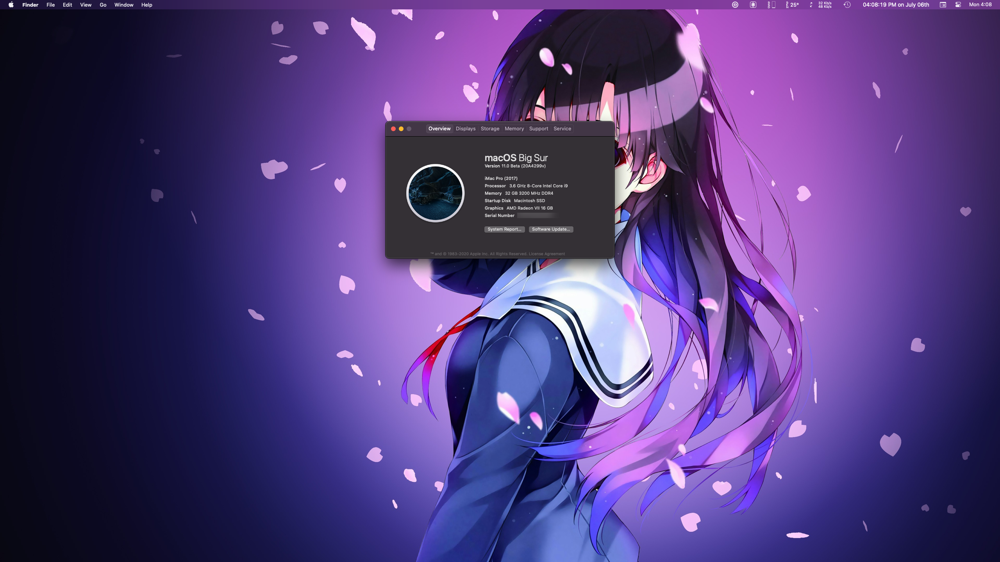

# OpenCore Setup

This is my personal configuration for running a Hackintosh using [OpenCorePkg](https://github.com/acidanthera/OpenCorePkg/releases).

I am uploading this as a public repository for two purposes:
1. Allow myself to keep track of changes I make and back them up.
2. Allow others with similar hardware to find a _possibly_ suitable configuration.

# Target

This configuration currently targets macOS 11.0 Beta (build 20A4299v).

Previous configuratrions:

* [macOS Catalina](https://github.com/emsquared/OpenCore-Setup/releases/tag/macOS-Catalina)

# Stability

It is possible some, or all, of these stability issues are a result of a beta operating system, and not a result of the configuration.

### Stability Issues

* ~~The Maps app & Messages crash on launch.~~ - Resolved by lowering display refresh rate to 60hz.
* Clock settings cannot be modified in System Preferences.
* Vibrancy effects appear to flicker in some alerts when using the zoom accessibility feature.

# Installation

I installed Big Sur on an unformatted disk using this configuration on an off-the-shelf USB stick. There was no trickery involved using another Mac or virtualization. 

I **do not** know if this configuration will work with in-place upgrades from macOS Catalina.

# Hardware

* **Case**: [Fractal Design Define R6](https://www.amazon.com/gp/product/B07HQKF7F2/)
* **Power**: [EVGA SuperNOVA 1000 G2](https://www.amazon.com/gp/product/B00CGYCNG2/)
* **Motherboard**: [Gigabyte Z390 AORUS PRO](https://www.amazon.com/gp/product/B07HRZRBRJ/)
* **Processor**: [Intel 9900K**F**](https://www.amazon.com/gp/product/B07MGBZWDZ/)
* **Graphics**: [XFX Radeon VII 16GB](https://www.amazon.com/gp/product/B07NFGDZWQ/)
* **Memory**: [HyperX Fury 32GB (2 x 16GB) 3200MHz DDR4](https://www.amazon.com/gp/product/B07WJJJ5M6/)
* **Primary Storage**: [Samsung SSD 850 EVO 500GB](https://www.amazon.com/gp/product/B00OBRE5UE/)
* **Bootcamp Storage**: [Samsung SSD 860 EVO 1TB](https://www.amazon.com/gp/product/B078DPCY3T/) (larger space for games)
* **Secondary Storage**: 4TB hard disk storage (7200rpm)
* **Display**: [Nixeus EDG 27" 1440p IPS display (NX-EDG27S v2)](https://www.amazon.com/gp/product/B07N4DL9F7/)

None of this hardware is overclocked.

_Note: My CPU comes without integrated graphics because it was cheaper and I have a dedicated GPU. **I therefore do not know if this configuration will work with integrated graphics.**_

Wifi and Bluetooth work with zero configuration, out of the box, using [this card](https://www.amazon.com/gp/product/B012LOT512/r).

### Watercooling Components

| Product | Quantity |
| --- | --- |
| [EK-Velocity - Nickel + Acetal](https://www.ekwb.com/shop/ek-velocity-nickel-acetal) | 1 |
| [EK-Vector Radeon VII RGB - Nickel + Acetal](https://www.ekwb.com/shop/ek-vector-radeon-vii-rgb-nickel-acetal) | 1 |
| [EK-Vector Radeon VII Backplate - Black](https://www.ekwb.com/shop/ek-vector-radeon-vii-backplate-black) | 1 |
| [EK-XRES 140 Revo D5 PWM - Glass](https://www.ekwb.com/shop/ek-xres-140-glass-revo-d5-pwm-incl-pump) | 1 |
| [EK-UNI Pump Bracket (140mm FAN) Vertical](https://www.ekwb.com/shop/ek-uni-pump-bracket-140mm-fan-vertical) | 1 |
| [EK-CoolStream SE 360 (Slim Triple)](https://www.ekwb.com/shop/ek-coolstream-se-360-slim-triple) | 1 |
| [EK-CoolStream SE 280 (Slim Dual)](https://www.ekwb.com/shop/ek-coolstream-se-280) | 1 |
| [EK-Meltemi 120ER Black](https://www.ekwb.com/shop/ek-meltemi-120er-black-500-1800rpm) | 3 |
| [EK-Furious Vardar EVO 140 BB](https://www.ekwb.com/shop/ek-furious-vardar-evo-140) | 2 |
| [EK-Cable Y-Splitter 2-Fan PWM (10cm)](https://www.ekwb.com/shop/ek-cable-y-splitter-2-fan-pwm-10cm) | 1 |
| [EK-Cable Y-Splitter 3-Fan PWM (10cm)](https://www.amazon.com/EKWB-EK-Cable-Y-Splitter-3-Fan-2-Pack/dp/B078G53932) | 1 |
| [EK-Tube ZMT Matte Black 16,1/11,1mm 3M](https://www.ekwb.com/shop/ek-tube-zmt-matte-black-16-1-11-1mm-3m-retail) | 1 |
| [EK-CryoFuel Clear (Premix 1000mL)](https://www.ekwb.com/shop/ek-cryofuel-clear-premix-1000ml) | 1 |
| [EK-Torque STC-12/16 - Black](https://www.ekwb.com/shop/ek-torque-stc-12-16-black) | 10 |
| [EK-Torque Angled 90° - Black](https://www.ekwb.com/shop/ek-torque-angled-90-black) | 3 |
| [EK-AF Angled 90° G1/4 Black](https://www.ekwb.com/shop/ek-af-angled-90-g1-4-black) | 2 |
| [EK-AF Angled 45° G1/4 Black](https://www.ekwb.com/shop/ek-af-angled-45-g1-4-black) | 1 |
| [EK-AF Ball Valve (10mm) G1/4 - Black](https://www.ekwb.com/shop/ek-af-ball-valve-10mm-g1-4-black) | 1 |
| [EK-AF T-Splitter 3F G1/4 - Black](https://www.ekwb.com/shop/ek-af-t-splitter-3f-g1-4-black) | 1 |
| [EK-AF Extender 6mm M-M G1/4 - Black](https://www.ekwb.com/shop/ek-af-extender-6mm-m-m-black) | 1 |
| [EK-AF Extender 30mm M-F G1/4 - Black](https://www.ekwb.com/shop/ek-af-ball-valve-10mm-g1-4-black) | 4 |
| [EK-AF Extender Rotary M-F G1/4 - Black](https://www.ekwb.com/shop/ek-af-extender-rotary-m-f-g1-4-black) | 3 |
| [EK-AF Extender Rotary M-M G1/4 - Black](https://www.ekwb.com/shop/ek-af-extender-rotary-m-m-g1-4-black) | 1 |

# Disclaimer

I am a novice when it comes to building a hackintosh. I do not understand a lot of what happens behind the scenes. This configuration is a combination of the helpful [vanilla guide](https://khronokernel-2.gitbook.io/opencore-vanilla-desktop-guide/) and [reading the entire docuemtnation](https://github.com/acidanthera/OpenCorePkg/blob/master/Docs/Configuration.pdf).

**I DO NOT provide any guarantees for this setup outside of my own use case.**
